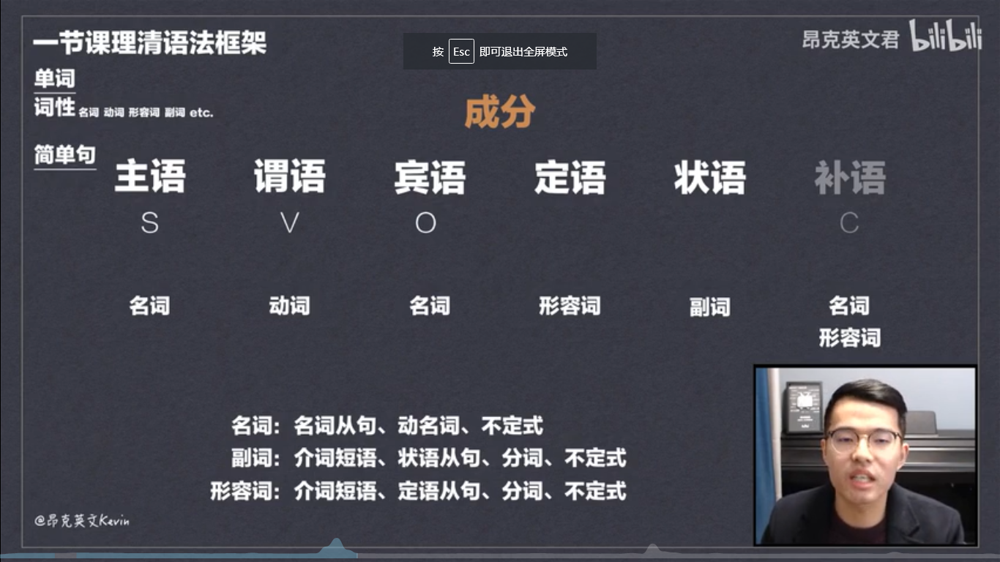
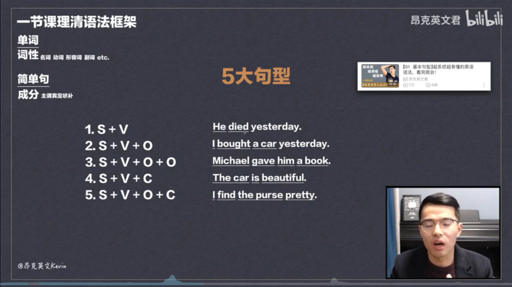
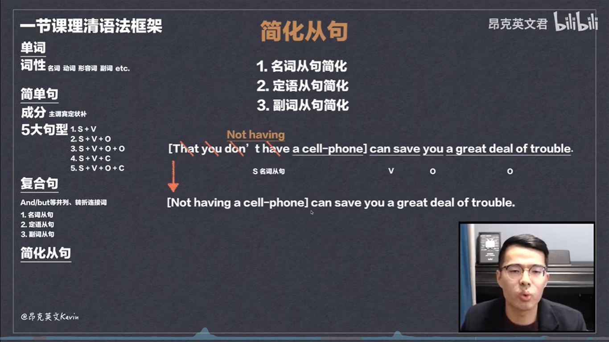

# 英语语法框架

>以下的内容来源于[昂克英文君](https://www.bilibili.com/video/BV1e7411z7sg)。

## 词性

* 名词 noun (n.)
* 动词 verb (v.)
* 形容词 adjective (adj.)
* 副词 adverb (adv.)
* 介词 preposition (prep.)
* 代词 pronoun (pron.)
* 数词 numeral (num.)
* 冠词 article (art.)
* 连词 conjuction (conj.)
* 感叹词 interjection (interj.)

&emsp; 在这十个词性中，最为常见的是前四个 : **名词**，**动词**，**形容词**和**副词**。  
&emsp; 这四个词性涵盖了超过了80 % 简单句。

## 简单句

&emsp; 那我们接下来聊一聊简单句吧。

### 简单句的组成成分为

* 主语 ( Subject,下面简写为S )
* 谓语 ( Predicate, 大多由动词组成，故下面简写为 V )
* 宾语 ( Object )
* 定语 ( Attributive )
* 状语 ( Adverbial )
* 补语 ( Complement )

&emsp; 这些组成部分的英文不需要刻意去记，只要了解一下就可以了。  
&emsp; 需要记住的是这些 ‘语’ 的成分。

 

 

### 简单句有五大句型:

* 主谓 ：S + V 
* 主谓宾 ：S + V + O 
* 主谓双宾 ：S + V + O + O
* 主谓补 ：S + V + C
* 主谓宾补 : S + V + O + C

下面是一些例句。

&emsp; 这里的我们说的主谓补，很多人会说是主系表，其实也没错。  
不过考虑到系动词是动词的一部分，而表语则是补语的一部分，这里我们就用主谓补代替了。

## 复合句

&emsp; 复合句说难也难，说不难也不太难。其实也就是用像 AND/BUT 这样的连接词将两个或多个简单句连在一起。

&emsp; 复合句比较难的点就是从句 ：名词从句，定语从句和副词从句等等。这一些从句我们在接下来会慢慢地去讲。

## 从句简化

&emsp; 在句子演化的过程中，因为长难句太过于繁琐，慢慢的其中的从句就开始简化。

&emsp; 以下就是一个名词从句简化的例子。

