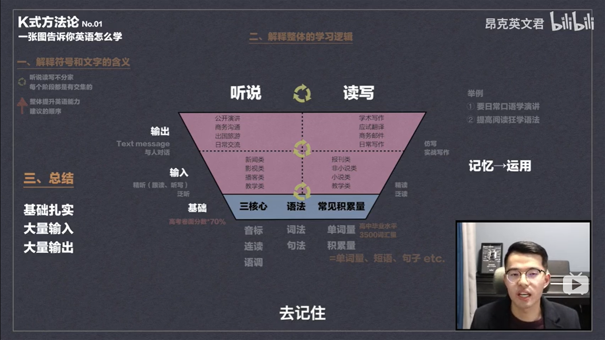

# 如何系统学习英语

## 前言

如果怕啰嗦的话可以直接跳下面的视频列表去看，总共十个视频，加起来可能会有两个小时多。当然这个东西不要求你看完，看完第一个你自己心里就会有个底。

## 导言

有些小伙伴在学习英语的路上或多或少的都会有点感到吃力，或者看着字典去背单词，可以背了就忘，背了就忘。

我这个人特别讨厌背单词，你让我去看文章都没有背单词那么痛苦。但我发觉，就是我这么一个从来不背单词就天天和人唠嗑的人，我法语能力都能提高。我就觉得很奇怪嘛，但我也没答案嘛。

但我的英语不好，这个我自己是知道的。平时我是看Youtube的，但天天逛也觉得没啥意思，因为中文up主有趣的也就那么几个。我就觉得有点郁闷，闲来无事就去逛bilibili，去看看英语的语法课。

我这人可以说大部分时间就三分钟热度，看完一些东西可能会感觉热血沸腾，然后收藏起来。大家都懂，收藏夹里吃灰吧!

这阵子因为新冠病毒的原因，没办法我就必须在家里呆着。平时的话待这么一周两周的我还可以，毕竟我平时也算是一个宅男。(好像就是哦哈哈)但这么待个几个月我还真吃不消。

我这个人吧，平时就闲不住。闲来无事的时候看见一堆文件堆在收藏夹里，心里就不大舒服。我就一阵清理，垃圾分类嘛。（感觉我收藏过视频的up主在提刀赶来的路上）

在处理一个“可回收垃圾”的时候，我一不小心撇到了昂克老师的**如何系统学习英语**。看完以后我炸了，感觉像是打通了任督二脉，我突然明白了我目前的语言水平的瓶颈。放一张昂克老师的学习反向金字塔吧。

在他的逻辑体系中，在**基础扎实**的情况下去进行**大量输入**和**大量输出**，就可以提高我们的学习能力。他的k式方法论十集两个小时多都可以总结成上面那么一句话，并在这个基础上提供了可供练习的素材。

从十几年的应试教育里到市面上我看过的课程里面，我更多的是看到对于某个方面去进行改善或者提高的老师。比如像正态分布数学题这样的东西，课堂上老师会去讲解这个题怎么解。但他很少会去和你说这个有什么用，在科学上他起到什么样的作用，或者说它在社会中在数学里中扮演了什么样的角色。这样的东西在你脑海里就是一堆嘈杂的信息，好一点的话叫做知识。

我觉得我们学习的是一种思维，而这种思维只有在框架清晰的情况下才能快速进步，而k式方法论正是提供了这么一个框架和需要去努力的方向。

我自己大致上过了一遍，没有去记笔记。我决定再去看一遍，认认真真的去记一下笔记。下面是他的方法论学习列表，我都给你们整理好了。等我在刷过一遍，做完笔记再去深入的聊一下每一集的主要内容。

## 课程列表

* [第01讲 一张图告诉你英语该怎么学 | 英语学习方法论](https://www.bilibili.com/video/BV1jE41157bX)
* [第02讲 不走弯路！全面分析市面上的英语课程](https://www.bilibili.com/video/BV1P7411U7vB/?spm_id_from=333.788.videocard.0)
* [第03讲 材料推荐 | 音标怎么学 英语发音三核心 美式英语音标](https://www.bilibili.com/video/BV1GC4y1s7cH/?spm_id_from=333.788.videocard.0)
* [第04讲 材料推荐 | 连读怎么学 英语发音三核心 英语听力听不懂的原因](https://www.bilibili.com/video/BV1sQ4y1K7f2/?spm_id_from=333.788.videocard.0)
* [第05讲 材料推荐 | 英语语调怎么学 注意事项 英语发音三核心](https://www.bilibili.com/video/BV1wi4y1876B/?spm_id_from=333.788.videocard.0)
* [第06讲 材料推荐 | 英语语法怎么学 同时分享我的语法学习经历](https://www.bilibili.com/video/BV1JC4y1x7Tm/?spm_id_from=333.788.videocard.0)
* [第07讲 英语词汇如何积累 从原理上讲解背单词的本质 | 不同阶段不同做法](https://www.bilibili.com/video/BV1U64y1T7kA/?spm_id_from=333.788.videocard.0)
* [第08讲 英语零基础 基础薄弱 | 怎么通过赖世雄美语从头学这套书打扎实基础](https://www.bilibili.com/video/BV1ya4y1v7WA/?spm_id_from=333.788.videocard.0)
* [第09讲 如何高效地提高英语听力口语 | 如何进行精听泛听 | 口语听不懂的原因](https://www.bilibili.com/video/BV1ek4y1677d/?spm_id_from=333.788.videocard.0)
* [第10讲 如何提高英语阅读和写作能力 | 英语精读泛读 | 英语阅读材料选择](https://www.bilibili.com/video/BV1pv411z7sB/?spm_id_from=333.788.videocard.0)
